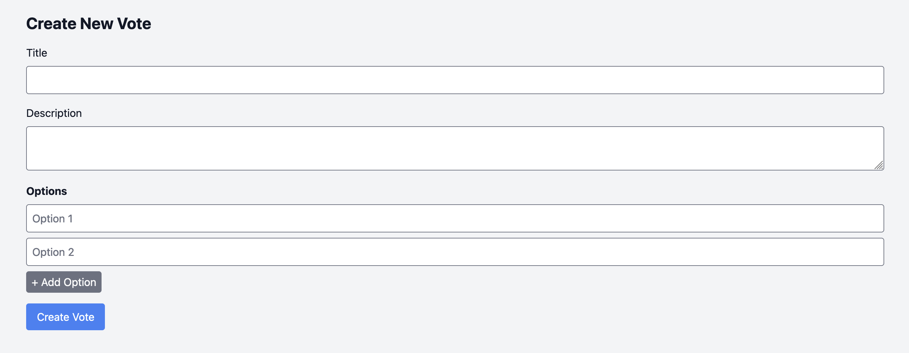
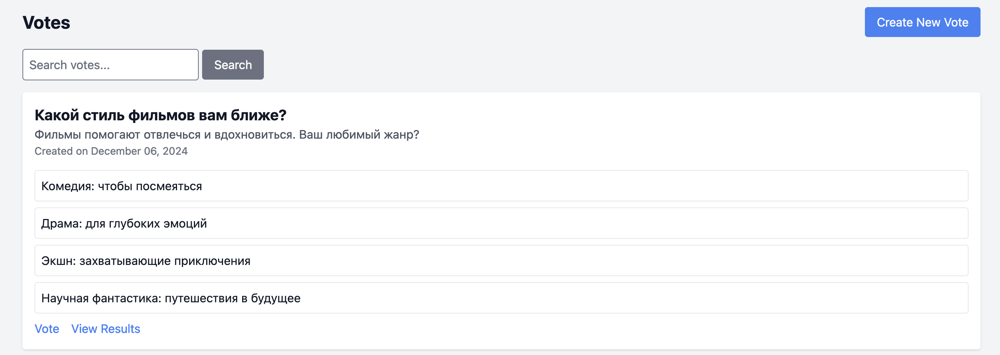
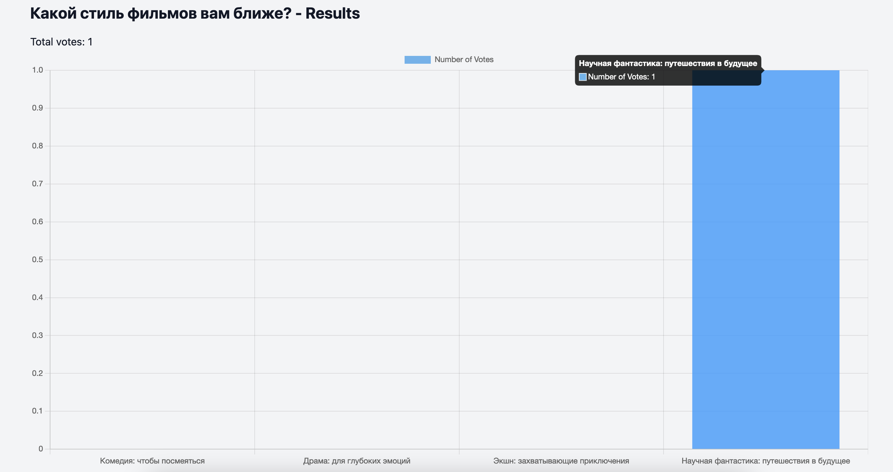
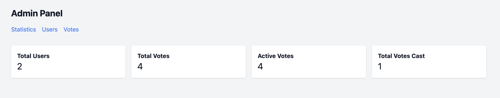
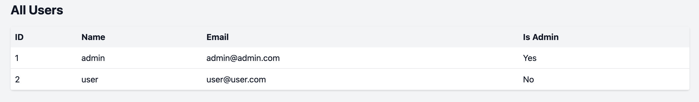
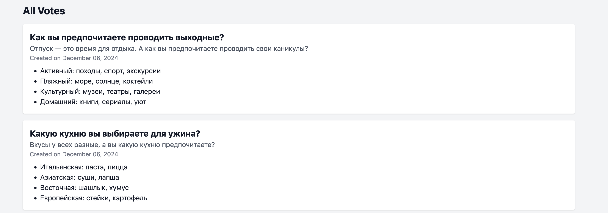

# Voting App

## Описание проекта

**Voting App** – это веб-приложение для создания и проведения голосований. Зарегистрированные пользователи могут создавать опросы с несколькими вариантами ответов, просматривать результаты голосований в режиме реального времени и видеть общую статистику. Администраторы имеют доступ к панелю управления, где они могут просматривать пользователей и голосования, а также анализировать общую статистику.

Основные функции:
- Регистрация и аутентификация пользователей.
- Создание голосований с управляемым количеством вариантов ответа.
- Участие в голосованиях и просмотр результатов.
- Админ-панель для мониторинга пользователей, голосований и активности.

## Структура веб-приложения

### Маршруты (Routes)

Маршруты объявлены в файлах `routes/web.php` и `routes/auth.php`.  
Ключевые маршруты:
- `/` – перенаправление на список голосований (`/votes`)
- `/votes` – список всех голосований (только для авторизованных пользователей)
- `/votes/create` – страница создания нового голосования
- `/votes/{vote}` – просмотр конкретного голосования и участие в нем
- `/votes/{vote}/cast` – отправка данных о выбранном варианте голосования
- `/votes/{vote}/results` – просмотр результатов голосования
- `/votes/{vote}` (DELETE) – удаление голосования (для владельца или администратора)
- `/admin` – главная страница админ-панели
- `/admin/users` – список всех пользователей (только для администратора)
- `/admin/votes` – список всех голосований (только для администратора)

Роуты для аутентификации (регистрация, вход, выход) предоставляются Laravel Breeze и находятся в `routes/auth.php`.

### Контроллеры (Controllers)

- `App\Http\Controllers\VoteController`:  
  - `index()` – отображение списка голосований  
  - `create()` – форма создания нового голосования  
  - `store()` – сохранение нового голосования в БД  
  - `show($vote)` – отображение конкретного голосования для участия  
  - `cast($vote)` – обработка отправленного варианта и запись голоса  
  - `results($vote)` – отображение результатов голосования  
  - `destroy($vote)` – удаление голосования (для автора или админа)
  
- `App\Http\Controllers\AdminController`:
  - `index()` – общая статистика в админ-панели  
  - `users()` – список пользователей  
  - `votes()` – список всех голосований

Контроллеры используют модели `Vote`, `Option`, `VoteCast`, `User` для взаимодействия с базой данных.

### Модели (Models)

- `App\Models\User` – модель пользователя. Имеет поле `is_admin` для определения администратора.
- `App\Models\Vote` – модель голосования. Содержит заголовок (`title`), описание (`description`), ссылку на автора (`user_id`) и связь с вариантами (`options`) и голосами (`casts`).
- `App\Models\Option` – модель варианта ответа. Связана с `Vote`.
- `App\Models\VoteCast` – модель, фиксирующая, какой пользователь выбрал какой вариант в определенном голосовании.

Каждая модель управляет логикой работы с соответствующей таблицей в базе данных.

## Структура клиентской части приложения

Фронтенд-часть основана на стандартной структуре Blade-шаблонов Laravel.  

Основные файлы шаблонов:
- `resources/views/layouts/app.blade.php` – основной шаблон, включающий верхнюю навигацию, уведомления о событиях, секцию `@yield('content')` для вставки контента.
- `resources/views/votes/*.blade.php` – набор шаблонов для работы с голосованиями: 
  - `index.blade.php` (список голосований),
  - `create.blade.php` (форма создания голосования),
  - `show.blade.php` (страница голосования для участия),
  - `results.blade.php` (страница результатов с диаграммой).
- `resources/views/admin/*.blade.php` – шаблоны для админ-панели (статистика, список пользователей, список голосований).
  
Стили и скрипты подключаются через Laravel Vite (`@vite(['resources/css/app.css', 'resources/js/app.js'])`).

Диаграммы результатов голосования формируются с помощью Chart.js (подключение CDN-скрипта в `results.blade.php`).

## Установка и запуск проекта

### Предварительные требования

- PHP >= 8.0
- Composer
- Node.js и npm
- СУБД: SQLite, MySQL или PostgreSQL

### Шаги установки

1. Склонируйте репозиторий или создайте новый проект Laravel:
   ```bash
   git clone <url> voting-app
   cd voting-app
   ```

2. Установите зависимости PHP:
   ```bash
   composer install
   ```

3. Создайте файл `.env`:
   ```bash
   cp .env.example .env
   ```
   Отредактируйте `.env`, указав настройки базы данных.

4. Сгенерируйте ключ приложения:
   ```bash
   php artisan key:generate
   ```

5. Запустите миграции и сидер для создания таблиц и админ-пользователя:
   ```bash
   php artisan migrate
   php artisan db:seed --class=AdminUserSeeder
   ```

   Админ-пользователь будет создан с email: `admin@admin.com` и паролем `password`.

6. Установите фронтенд-зависимости и соберите ассеты:
   ```bash
   npm install
   npm run dev
   ```

7. Запустите локальный сервер:
   ```bash
   php artisan serve
   ```
   
   Перейдите по адресу `http://localhost:8000` в браузере.

## Авторы проекта

- Киллограм Налички.
- Контакты: Ай, забыл.

## Цель и основные функции

Цель проекта – упростить процесс создания и проведения онлайн-голосований, предоставляя удобный интерфейс для авторов и участников, а также инструменты для администрирования и анализа результатов.

Основные функции:
- Регистрация и вход пользователей.
- Создание неограниченного количества опросов с любым числом вариантов ответа.
- Возможность голосовать и сразу видеть результаты в наглядном виде.
- Административная панель для мониторинга активности и статистики.

## Примеры использования

- Создайте новый опрос, указав заголовок и варианты ответов:


- Просмотрите список опросов:


- Проголосуйте и посмотрите результаты в виде диаграммы:


- Админ-панель для анализа:



## Источники

- [Документация Laravel](https://laravel.com/docs)
- [Laravel Breeze](https://github.com/laravel/breeze)
- [Chart.js](https://www.chartjs.org/)

## Дополнительно

- Код организован по стандартам Laravel, что упрощает дальнейшее сопровождение.
- Аутентификация и авторизация настроены с помощью Laravel Breeze.